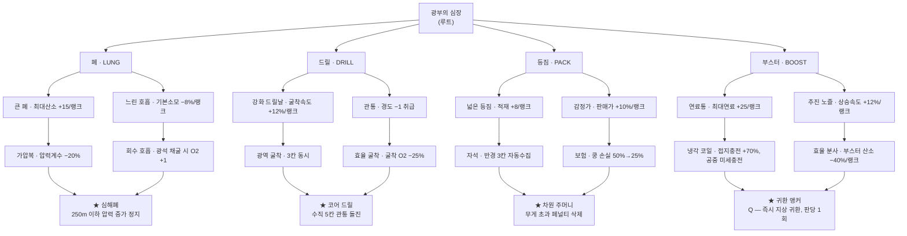

# Dig Deeper — 게임 기획 v0.3

> v0.3 — **산소 모델 전면 교체**: 산소는 이제 오직 *현재 깊이*로만 소모된다.
> 굴착·부스터·적재 무게·환경 배율은 산소를 건드리지 않는다. 그 밖에:
> 블록 20px → 32px(월드 폭 48 → 32타일), Esc 일시 정지, 긴급 귀환 삭제,
> 스킬 트리 4갈래 24노드 → **5갈래 35노드 + 교차 7**.
>
> v0.2 — 발밑 부스터 도입(암벽 등반 삭제), 플레이 가능 프로토타입 `prototype/index.html`.
> 모든 수치는 Playwright 자동 플레이테스트 실측이고, 수정 사유는 각 절의 인용 블록에 남겼다.

> 「굴착소년 쿵」 계보의 2D 종스크롤 채굴 로그라이트.
> **한 판 = 한 번의 하강.** 산소가 곧 제한 시간이고, 깊이가 곧 난이도이며,
> 가져온 골드는 영구 스킬 트리에 투자된다.

---

## 1. 한 줄 컨셉

> *"얼마나 깊이 내려갈 수 있는가"* 를 산소 예산으로 계산하는 자원 관리 게임.
> 매 판마다 지형은 새로 생성되고, 매 판이 끝날 때마다 캐릭터는 영구히 강해진다.

**핵심 긴장감:** 한 칸 더 파면 더 비싼 광석이 나온다. 그런데 돌아갈 산소가 남을까?
플레이어가 매 순간 내리는 결정은 단 하나 — **"내려갈까, 돌아갈까."**

---

## 2. 코어 루프

```
[지상 허브]
   │  ① 장비 점검 / 스킬 트리 투자
   ▼
[하강 — 절차 생성된 광산]
   │  ② 굴착 · 광석 수집 · 위험 회피
   │     산소가 계속 줄어든다 (깊이에 비례해 가속)
   ▼
[귀환 판단]
   │  ③ 자력 귀환 → 전리품 100% 보존
   │     산소 고갈("쿵") → 구조되지만 전리품 일부 손실
   ▼
[정산]
   │  ④ 광석 → 골드 환전, 최고 깊이 갱신 보상
   ▼
[스킬 트리]  ⑤ 골드로 노드 해금 → ①로 복귀
```

**목표 플레이 타임**
| 구간 | 1판 길이 | 도달 깊이 |
|---|---|---|
| 초반 (1~10판) | 2~4분 | ~80m |
| 중반 (11~40판) | 5~8분 | ~300m |
| 후반 (41판~) | 8~14분 | 650m+ |

---

## 3. 조작 & 액션

| 입력 | 동작 | 비용 |
|---|---|---|
| A / D | 이동 · 벽에 닿으면 좌우 굴착 | 경도 비례 산소 |
| S | 아래 블록 굴착 (드릴이 암반을 짚어 등속 하강) | 경도 비례 산소 |
| W / Space | **발밑 부스터** — 등속 상승 (연료 소모) | 산소 ×1.8 |
| Esc | 일시 정지 (남은 산소 / 귀환 필요 산소 확인, 하강 포기) | — |
| F | 코어 드릴 — 아래 5칸 관통 (드릴 정점) | — |
| Q | 귀환 앵커 — 즉시 지상 귀환 (부스터 정점, 판당 1회) | — |

> **긴급 귀환(R)은 삭제했다.** 언제든 눌러서 빠져나올 수 있는 버튼이 있으면
> "돌아갈 산소를 남길까"라는 계산 자체가 무의미해진다. 이제 나가는 길은
> 부스터로 올라가는 것, 귀환 앵커, 그리고 쿵(산소 고갈) 세 가지뿐이다.
> Esc 메뉴의 「하강 포기」는 게임 능력이 아니라 UI 탈출구이고, 쿵과 같은 손실률을 적용한다.

> **설계 의도:** 위로 파는 것은 불가능(중력·붕괴 설정). 따라서 하강은 되돌릴 수 없고,
> 귀환은 **발밑 부스터**로 자기가 파 내려온 샤프트를 거슬러 올라가야 한다.
> 암벽 등반 같은 별도 이동 수단은 없다 — 오직 부스터뿐이다.

### 3.1 부스터와 연료 (귀환의 전부)

| 항목 | 값 | 비고 |
|---|---|---|
| 최대 연료 | 100 | 스킬로 최대 210 |
| 상승 속도 | 320 px/s (10타일/s) | **등속** — 가속형이 아니라 공중 정지·미세 조작 가능 |
| 연료 소모 | 36 /초 | 만탱크 ≈ 2.8초 ≈ 28타일 |
| **재점화 임계치** | 최대치의 35% | 연료가 마르면 이만큼 채워야 다시 점화된다 |
| 접지 충전 | 34 /초 (100%) | 발이 땅에 닿아 있을 때 |
| 굴뚝 충전 | 27 /초 (80%) | 좌우 벽에 닿아 **완속 하강(55 px/s)** 중 |
| 활공 충전 | 15 /초 (45%) | 연료 없이 W 유지 — **활공(100 px/s)** 중. 「냉각 코일」로 +25%p/랭크 |

**상승 사이클 산술** (이게 귀환 속도를 결정한다)

| 경로 | 분사 상승 | 재충전 하강 | 사이클 순이득 | 실효 속도 |
|---|---|---|---|---|
| 굴뚝 (좌우 벽) | +9.7타일 / 0.97초 | −2.2타일 / 1.29초 | **+7.5타일** | 3.3타일/s |
| 활공 (동굴) | +9.7타일 / 0.97초 | −7.2타일 / 2.29초 | **+2.5타일** | 0.8타일/s |

> **왜 활공을 넣었는가.** 벽이 없는 동굴에서는 굴뚝 버티기가 불가능해
> 자유낙하로 상승 진척이 전부 사라졌다. 활공(연료 0에서도 W를 누르면 임펠러가
> 공회전해 낙하 속도가 제한된다)을 넣어 **W는 언제 눌러도 손해가 없는 키**로 만들었다.
> 단 활공은 굴뚝의 1/4 속도라, 수직 샤프트를 잘 파 두는 것이 여전히 압도적으로 유리하다.

> **왜 재점화 임계치가 필요했는가.** 처음에는 연료가 0이어도 W를 누르면
> 매 프레임 점멸하듯 재점화됐다. 분사 중에는 충전이 멈추므로 플레이어가
> 스스로 충전을 방해해 **순 상승이 0**이 됐다(실측: 73m에서 30초간 제자리).
> 35% 임계치를 두자 "태우고 → 채우고 → 다시 태운다"는 리듬이 생겼다.

**1타일 샤프트는 굴뚝이 된다.** 연료가 마르면 벽에 닿은 채 천천히 미끄러지며 재충전하고,
다시 상승한다 — 이 왕복을 반복해 지상까지 오른다.
A/D로 벽을 파 발판을 만들면 100% 속도로 충전되지만 그 굴착에도 산소가 든다.

> **왜 이렇게 하는가.** 초기 설계에서는 연료를 접지 중에만 충전했다. 그런데 수직 굴착으로
> 내려가면 착지할 곳이 없어 **귀환이 물리적으로 불가능**했다(프로토타입 실측: 8회 상승 시도
> 순진척 +0m, 내구만 84 소실). 굴뚝 버티기를 넣으면 귀환은 다시
> *"올라갈 수 있는가"* 라는 플랫포밍 수수께끼가 아니라
> **"올라가는 데 산소를 얼마나 태울 것인가"** 라는 자원 문제로 돌아온다 — 원래 의도한 긴장감이다.

---

## 4. 산소 시스템 (핵심 시스템)

### 4.1 기본 공식 — 오직 깊이

```
O2 -= drain(depth) * dt

drain(d) = O2_IDLE + d × O2_PER_M
         = 0.60    + d × 0.0100        (무강화)
```

**이것이 전부다.** 굴착, 부스터 분사, 적재 초과, 지층 환경 — 어느 것도 산소를
소모하지 않는다. 각각의 대가는 다른 자원으로 받는다.

| 행동 | 대가 |
|---|---|
| 굴착 | **시간** (경도 × 0.5초 / 굴착속도) — 시간이 곧 깊이×소모율이다 |
| 부스터 상승 | **연료** |
| 적재 초과 | 이동 속도 −45%, 상승 속도 −30% |
| 유독가스 | 즉발 산소 −18 (「폐 정화」로 −70%) |
| 용암 | 내구(HP) |

> **왜 바꿨는가.** 이전 모델은 `drainBase × pressure × envMult`에 굴착 1회당
> `hardness × 0.6 × pressure`, 부스터 ×1.8, 무게 ×1.3, 가스 3초 ×2를 전부 곱하고
> 더했다. 결과적으로 플레이어는 **자기 산소가 왜 줄어드는지 알 수 없었다** —
> 화면의 숫자만 보고는 다음 행동의 비용을 계산할 수 없다.
> 지금은 HUD의 `O₂/s` 하나가 곧 전부이고, 그 값은 깊이만 보면 예측된다.
> "내려갈까, 돌아갈까"가 감이 아니라 산수가 된다.

### 4.2 깊이별 소모율

| 깊이 | 무강화 | 만빌드 | 체감 |
|---|---|---|---|
| 0m | 0.60 /s | 0.41 /s | 여유 |
| 50m | 1.10 /s | 0.53 /s | 계산 시작 |
| 100m | 1.60 /s | 0.65 /s | 귀환 예산 확인 |
| 250m | 3.10 /s | 1.01 /s | 무강화로는 불가능 |
| 450m | 5.10 /s | 1.49 /s | 보급 필수 |
| 650m | 7.10 /s | 1.97 /s | 최종 빌드 + 보급 전용 |

만빌드 = `느린 호흡` 3랭크(기본 −33%) + `가압복` 2랭크(계수 −48%) + `심해폐`(계수 −35%).

### 4.2.1 HUD가 보여주는 두 숫자

1. **`O₂/s`** — 지금 이 깊이의 소모율, 수식까지 그대로 표시한다.
2. **`귀환 필요 ≈ N O₂`** — 지금 깊이에서 부스터로 지상까지 오르는 데 드는 산소.
   상승 사이클(분사 + 재충전 대기)을 실제 스탯으로 적분한 값이다.
   남은 산소보다 커지면 빨갛게 바뀐다.

> 이 두 숫자가 없으면 깊이 기반 모델도 여전히 불투명하다. 공식이 단순해진 것과
> **플레이어가 그 공식을 읽을 수 있는 것**은 별개의 작업이다.

> **밸런스 앵커 (실측):** 무보급 직하강 왕복 한계 — 무강화 **83m**, 중반 빌드 **~110m**,
> 트리 완주 **~280m**. 실측 왕복: 73m 하강 26초(산소 24) → 지상 귀환 25초(산소 21).
> 심연층(420m+) 이하는 에어포켓·산소 결정·「회수 호흡」 보급을 전제로 한다.

### 4.3 산소 보급 수단

| 수단 | 회복량 | 배치 규칙 |
|---|---|---|
| 에어 포켓 | +28 (「산소 정제기」로 ×2) | 3청크(48m)마다 **최소 1개 보장** |
| 회수 호흡 | 직접 채굴한 광석당 +1~2 | 광역 굴착으로 덤으로 깨진 타일은 제외 |
| 비상 캔 (소지품) | +60 | 지상에서 골드로 구매, 1회용, 슬롯 차지 |
| 지상 복귀 | 전량 | — |

### 4.4 "쿵" — 산소 고갈

산소 0 → 즉사 아님. **기절 후 구조**.
- 소지 광석의 **50% 손실** (스킬로 최대 10%까지 경감)
- 해당 판의 최고 깊이 기록은 **인정됨** (마일스톤 보상은 받음)
- 부활/재도전 없음, 바로 정산 화면

> 즉사가 아니라 "손실"로 처리하는 이유: 욕심을 부리는 플레이가
> 완전히 처벌받지 않아야 반복 도전이 즐겁다. 다만 손실률 50%는
> "자력 귀환이 항상 더 이득"이라는 명제를 유지할 만큼 아프다.

---

## 5. 절차적 지형 생성

### 5.1 원칙

1. **시드 기반 결정론** — 동일 시드 → 동일 지형 (일일 챌린지·버그 재현용)
2. **청크 단위 생성** — 16×16 타일 청크. 월드 폭은 48타일(3청크)로 고정된 수직 광정이고, 청크는 아래로만 무한 생성된다
3. **규칙 우선, 노이즈는 재료** — 노이즈로 뽑고, **규칙 패스가 검증·수정**한다
4. **불가능한 판을 만들지 않는다** — 아래 5.4 보장 패스 필수

### 5.2 깊이 밴드 (레이어) 정의

| 밴드 | 깊이 | 경도 | 주요 광석 | 위험 요소 | envMult |
|---|---|---|---|---|---|
| 표토층 | 0–40m | 1–2 | 석탄, 구리 | 소형 낙석 | 1.0 |
| 암반층 | 40–120m | 2–4 | 철, 은 | 낙석, 물주머니 | 1.0 |
| 결정층 | 120–250m | 4–6 | 금, 수정 | 유독가스 주머니, 박쥐 | 1.0 / 2.0(가스) |
| 용암대 | 250–420m | 6–8 | 루비, 흑요석 | 용암 웅덩이, 열기 | 1.5 |
| 심연층 | 420–650m | 8–11 | 심연강, 코어 조각 | 암흑(시야 제한), 심연충 | 1.5 |
| 코어 | 650m+ | 12+ | 코어 조각(다량) | 위 전부 + 지열 분출 | 2.0 |

밴드 경계는 ±8m 랜덤 지터를 줘서 "정확히 40m에서 바뀐다"는 느낌을 없앤다.

### 5.3 생성 파이프라인

```
seed + chunkY
  ↓
[1] 밴드 조회 ── 깊이로 layer 프로파일 선택
  ↓
[2] 기반 채움 ── 전 타일을 해당 밴드 기본암으로
  ↓
[3] 동굴 카빙 ── value noise(octave 3) > threshold 인 타일 제거
                 threshold는 깊을수록 상승 → 심층은 동굴이 적고 빽빽함
  ↓
[4] 광맥 배치 ── 시드 포인트를 포아송 디스크로 흩고,
                 각 포인트에서 random-walk 3~9칸 성장 (덩어리형 광맥)
                 광석 종류는 밴드별 가중 테이블에서 롤
  ↓
[5] 위험 배치 ── 가스 주머니/용암/불안정암을 밴드 확률표대로
                 (불안정암: 파면 위쪽 블록이 낙하)
  ↓
[6] 구조물 주입 ── 확률 롤로 손대지 않은 공간에 프리팹 삽입
                   (폐광 갱도 / 보물 금고 / 지하 사당 / 무너진 캠프)
  ↓
[7] 보장 패스 ── 아래 규칙 강제 적용 (5.4)
  ↓
[8] 최종 청크
```

### 5.4 보장 패스 (Guarantee Pass) — "규칙"의 핵심

생성 직후 반드시 검사하고, 위반 시 **수정한다**.

| 규칙 | 내용 |
|---|---|
| G1 · 하강 가능성 | 청크 상단에서 하단까지 굴착만으로 도달 가능한 경로가 존재해야 함. 없으면 최단 경로의 경도를 1 낮춤 |
| G2 · 산소 예산 | 50m 밴드마다 에어포켓 ≥ 2. 부족하면 동굴 공간에 강제 배치 |
| G3 · 즉사 금지 | 하강 진입 지점 반경 4타일 내 용암/즉사 요소 배치 금지 |
| G4 · 광석 최소 밀도 | 청크당 광석 타일 ≥ 밴드별 하한(표토 16% / 암반 14% / 결정 11% / 그 이하 9%). 미달 시 저급 광석으로 채움 |
| G5 · 위험 상한 | 청크당 치명 위험(용암·가스) 타일 ≤ 12%. 초과분 제거 |
| G6 · 보상 페이싱 | 100m마다 "가치 상위 광석" 광맥 ≥ 1개 보장 |

> **밴드별 하한을 둔 이유:** 1타일 수직 샤프트는 열 하나만 샘플링한다. 균일 6%로는
> 첫 판 수익이 27 G에 그쳐 설계 목표(~120 G)에 크게 미달했다. 상단 밴드를 후하게 만든 뒤
> 실측 124~283 G로 정상화됐다.
>
> G1·G2가 없으면 절차 생성 게임은 반드시 "운으로 죽는 판"을 만든다.
> 로그라이트에서 플레이어가 용납하는 실패는 *자기 판단 실패*뿐이다.

### 5.5 생성기 파라미터 예시

```jsonc
// data/layers.json
{
  "crystal": {
    "depthRange": [120, 250],
    "hardness": [4, 6],
    "caveThreshold": 0.58,
    "oreTable": [
      { "id": "gold",    "weight": 22, "veinSize": [3, 6] },
      { "id": "crystal", "weight": 14, "veinSize": [2, 4] },
      { "id": "iron",    "weight": 40, "veinSize": [4, 9] },
      { "id": "o2_gem",  "weight":  8, "veinSize": [1, 2] }
    ],
    "hazards": [
      { "id": "gas_pocket", "chancePerChunk": 0.35 },
      { "id": "bat_nest",   "chancePerChunk": 0.20 }
    ],
    "structures": [
      { "id": "abandoned_shaft", "chance": 0.12 },
      { "id": "treasure_vault",  "chance": 0.04 }
    ]
  }
}
```

---

## 6. 자원 & 경제

### 6.1 광석 가치 / 무게

| 광석 | 판매가 | 무게 | 등장 밴드 |
|---|---|---|---|
| 석탄 | 9 | 1 | 표토 |
| 구리 | 18 | 1 | 표토~암반 |
| 철 | 30 | 2 | 암반~결정 |
| 은 | 70 | 2 | 암반~결정 |
| 금 | 160 | 3 | 결정~용암 |
| 수정 | 220 | 2 | 결정~ |
| 흑요석 | 380 | 4 | 용암 |
| 루비 | 450 | 3 | 용암~심연 |
| 심연강 | 900 | 5 | 심연~코어 |
| **코어 조각** | (재화) | 1 | 심연~코어 |

### 6.2 적재 무게

- 기본 적재 한계 **40**
- 초과 시: 이동속도 −35%, 산소 소모 **×1.3** → 사실상 즉시 귀환 압박
- 심연강 5무게 = "이거 하나 들면 다른 걸 버려야 한다"는 선택 유발

### 6.3 화폐 2종

| 화폐 | 획득 | 용도 |
|---|---|---|
| **골드** | 광석 판매, 깊이 마일스톤 | 스킬 트리 노드 대부분 |
| **코어 조각** | 심연층 이하 채굴, 보스급 챌린지 | T4·정점 노드 게이트, 리스펙(2개), 특수 장비 |

**깊이 마일스톤 보상 (최초 1회, 판 결과와 무관)**
50m/100m/150m … 50m 단위로 `골드 = 깊이 × 4` 지급 + 100m 단위마다 신규 노드 티어 해금.

---

## 7. 스킬 트리

### 7.1 구조

중앙 루트 **「광부의 심장」** 에서 4개 갈래가 뻗는다. 전부 트리 구조 —
상위 노드는 반드시 부모 노드를 선행 해금해야 한다.



### 7.2 티어 · 비용 규칙

| 티어 | 해금 조건 | 노드 기본가 | 최대 랭크 |
|---|---|---|---|
| T1 (갈래 시작) | 루트 해금 | 80 G | 1 |
| T2 | 해당 갈래 누적 **1포인트** | 220 G | 3 |
| T3 | 해당 갈래 누적 **5포인트** | 600 G | 2 |
| T4 (★ 정점) | 해당 갈래 누적 **7포인트** | 1,600 G + 코어 조각 3 | 1 |

**v0.3 트리 규모** — 5갈래 × 7노드 = 35노드 + 교차 7노드.
다섯 번째 갈래는 **탐사(SCAN)**: 지질 감각(광석 윤곽) → 랜턴·감정 스캔 →
위험 감지·산소 탐지 → ★심층 스캔(암흑 무시 · 화면 전체 투시).
실측으로 68회 구매에 정점 5/5 + 교차 7/7이 모두 열린다.

> **v0.1의 게이트(3/8/14)는 수학적으로 도달 불가능했다.** 갈래 하나에서 얻을 수 있는
> 총 포인트는 12(T1 1 + T2 6 + T3 4 + T4 1)인데, T1이 최대 1랭크이므로 T2 게이트 3을
> 절대 넘을 수 없었고 T4 게이트 14는 상한 자체를 초과했다. 프로토타입 자동 테스트에서
> 잡아 0/1/5/7로 교정했다. 갈래마다 획득 가능 포인트가 다르므로(탐사 9 ~ 등짐 14)
> 게이트는 **가장 얇은 갈래**를 기준으로 잡아야 한다.

**랭크 비용 스케일:** `cost(n) = base × (1 + 0.6 × (n−1))`
> 예) T2 노드 3랭크 총비용 = 220 + 352 + 484 = **1,056 G**

**정점(★) 노드는 갈래당 1개만 선택 가능** — 두 T3 부모 중 하나만 찍어도 도달하지만,
갈래마다 정점은 하나. 4갈래 = 최대 4개 정점 → **빌드 정체성**이 생긴다.

### 7.3 교차 노드 (하이브리드)

두 갈래에 동시 투자한 플레이어에게만 열리는 노드. 트리를 다이아몬드로 만든다.

| 노드 | 조건 | 효과 | 비용 |
|---|---|---|---|
| 산소 재활용 드릴 | 폐 6 + 드릴 6 | 굴착 O2 소모의 30%를 되돌려받음 | 900 G |
| 광부의 직감 | 등짐 6 + 부스터 6 | 화면 밖 광맥·에어포켓 실루엣 표시 | 900 G |
| 압축 채굴 | 폐 6 + 등짐 6 | 광석 무게 −1 (최소 1) | 900 G |
| 비상 부양 | 부스터 6 + 폐 6 | 산소 15% 이하 시 상승 속도 2배, 연료 소모 절반 | 900 G |

### 7.4 리스펙

코어 조각 **2개**로 전체 초기화, 골드는 100% 환급.
> 빌드 실험을 장려하되 무료는 아니게 — 코어 조각은 심연층(420m+)에서만 나온다.

---

## 8. 진행 곡선 (레퍼런스 시뮬레이션)

| 판 | 누적 골드 | 대표 강화 | 도달 깊이 | 판당 수입 |
|---|---|---|---|---|
| 1 | 0 | — | 45m | ~120 G |
| 5 | ~900 | 큰 폐 R1, 강화 드릴날 R1 | 95m | ~300 G |
| 12 | ~4,500 | T2 다수, 자석 | 180m | ~800 G |
| 25 | ~18,000 | T3 2~3개 | 300m | ~2,200 G |
| 40 | ~55,000 | 정점 1~2개 + 교차 노드 | 480m | ~5,000 G |
| 60+ | ~150,000 | 정점 4개 | 650m+ | ~12,000 G |

**밸런싱 검증 규칙:** 판당 수입 증가율이 다음 티어 비용 증가율(×2.7)보다
살짝 낮아야 한다. 목표는 **"다음 노드까지 2~4판"** 이 계속 유지되는 것.
이 간격이 1판으로 줄면 지루해지고, 8판으로 늘면 그만둔다.

---

## 9. 위험 요소 상세

| 요소 | 밴드 | 동작 | 대응 |
|---|---|---|---|
| 낙석 | 표토~ | 불안정암 굴착 시 위 블록 낙하, HP −15 | 굴착 순서 계획 |
| 물주머니 | 암반 | 파면 물 방류, 산소 소모 ×1.8 (수중) | 아래에서 접근 금지 |
| 유독가스 | 결정 | 주머니 파열 시 산소 즉시 −15, 3초간 ×2.0 | 색 구분(초록 균열) |
| 용암 | 용암대 | 접촉 시 HP −50, 즉시 후퇴 | 우회 굴착 |
| 열기 | 용암대 | 지속 envMult 1.5 | 내열 장비 / 통과 속도 |
| 암흑 | 심연 | 시야 반경 4타일 | 랜턴 장비, 광부의 직감 |
| 심연충 | 심연 | 추적형, HP −25 · 산소 −10 | 대시 회피, 드릴 반격 |

**HP는 산소의 보조 자원**: 기본 100, 지상에서만 회복. HP 0 = 쿵과 동일 처리.
> HP를 별도 페일 조건으로 두지 않고 "쿵"으로 수렴시키면
> 플레이어가 관리할 게이지가 실질적으로 하나(산소)로 유지된다.

---

## 10. 데이터 구조 초안

```jsonc
// data/skills.json
{
  "lung_big": {
    "branch": "lung", "tier": 2, "parent": "lung_root",
    "maxRank": 3, "baseCost": 220,
    "effects": [{ "stat": "o2Max", "op": "add", "perRank": 15 }]
  },
  "lung_apex_deepsea": {
    "branch": "lung", "tier": 4, "parent": ["lung_suit", "lung_recycle"],
    "parentMode": "any",
    "maxRank": 1, "baseCost": 1600, "coreShardCost": 3,
    "exclusiveGroup": "apex_lung",
    "effects": [{ "stat": "pressureCapDepth", "op": "set", "value": 250 }]
  }
}
```

```jsonc
// 런 결과 저장
{
  "seed": 1837472,
  "maxDepth": 312,
  "oresCollected": { "gold": 14, "ruby": 2 },
  "goldEarned": 3140,
  "coreShards": 1,
  "endReason": "returned" // | "oxygen_out" | "hp_out"
}
```

---

## 11. 기술 스택 제안

| 단계 | 스택 | 이유 |
|---|---|---|
| **프로토타입 (M0~M1)** | TypeScript + Vite + Canvas2D, 순수 ECS 없이 단순 클래스 | 타일맵·산소 공식·생성기 규칙을 **빠르게 수치 검증**하는 게 목적. 브라우저에서 즉시 실행/공유 가능 |
| **정식 (M2~)** | Godot 4.x (GDScript) | TileMap·물리·파티클·모바일 빌드가 기본 제공. 채굴 게임의 요구사항과 정확히 일치 |

**공통 원칙:** 밸런스 수치(`layers.json`, `ores.json`, `skills.json`)는
전부 **코드 밖 JSON**. 엔진을 갈아타도 데이터는 그대로 이식된다.

**밸런스 시뮬레이터**: 렌더링 없이 생성기 + 산소 공식만 돌려
"시드 1000개 × 빌드 N개 → 평균 도달 깊이/수입"을 뽑는 CLI를 M1에 함께 만든다.
손으로 밸런싱하지 않는다.

---

## 12. 마일스톤

| | 산출물 | 완료 기준 |
|---|---|---|
| **M0** ✅ | 굴착 프로토 | 타일 파괴 + 중력 + 산소 감소 — `prototype/index.html` 완료 |
| **M1** 🔶 | 생성기 + 보장 패스 | G2·G3·G4·G5 구현 완료. **남은 것:** G1 하강 가능성 검증, G6 보상 페이싱, 시드 1000개 배치 검증 CLI |
| **M2** ✅ | 루프 완성 | 하강→귀환→정산→강화→재시작 순환 동작 (4판 연속 자동 테스트 통과) |
| **M3** 🔶 | 스킬 트리 전체 | 4갈래 × T1~T4 + 교차 노드 구현 완료. **남은 것:** 리스펙 UI |
| **M4** | 콘텐츠·연출 | 6개 밴드 아트, 위험 요소 전종, 사운드, 일일 시드 |

---

## 13. v1 범위 제외 (의도적)

- 멀티플레이 / 리더보드 (일일 시드 기록만 로컬 저장)
- 제작(crafting) 시스템 — 스킬 트리와 역할이 겹쳐 의사결정을 흐림
- 스토리 / 컷신 — 심연 도달 시 짧은 엔딩 텍스트로 대체
- 소모품 다양화 — 비상 캔 1종만 유지

---

## 14. 미결 사항

1. **수평 탐색의 가치** — 현재는 수직 하강이 압도적으로 유리하다. 수평으로 가야만
   닿는 고가치 금고를 얼마나 자주 배치해야 "옆으로 팔 이유"가 생기는가?
2. **귀환 연출** — 파온 통로를 되짚어 올라가는 건 지루할 수 있다.
   「귀환 앵커」를 정점이 아니라 T2로 내려야 할지 검토 필요.
3. **정점 노드 배타성** — 갈래당 1개 제한이 너무 답답한가? 최종 회차에선 해제할지.
4. **쿵 손실률 50%** — 플레이테스트 없이는 확신 불가. 30~60% 범위에서 A/B 필요.
